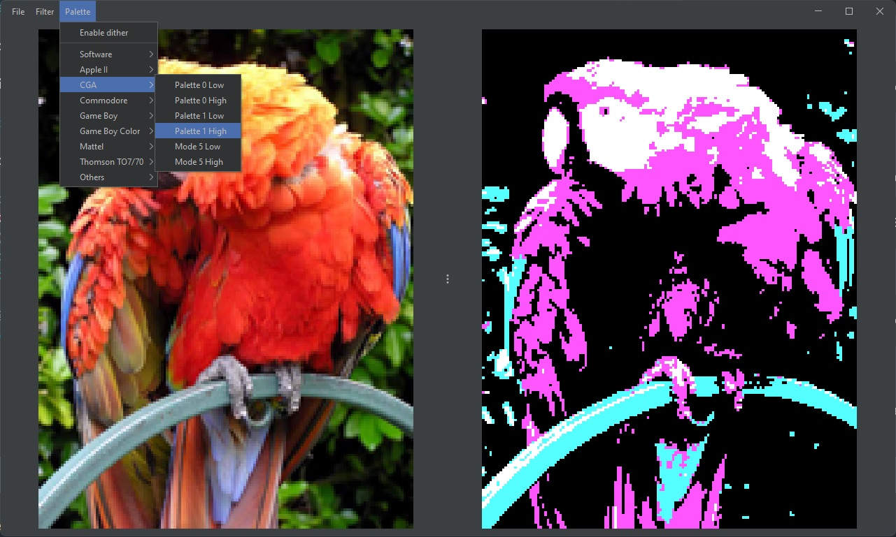

# ATHON

Athon is a basic program that allow to modify an image applying a filter or a specific color palette.



Current available filters :
- Greyscale
- Negative
- Sepia

Current available palettes :
- CGA
- Others (Gameboy,etc...)

Current supported file formats :
- BMP
- GIF
- JPEG
- PNG
- TIFF
- WBMP

## Custom palette
Palettes are located in the file __"palettes.json"__ under the folder __"LIB"__ , you can edit current palettes or add new ones.

To create a new entry add a section like the following:
```
{
    "Section"   : "My palettes",
    "Name"      : "Test palette",
    "Palette"   : ["FF0000","00FF00","0000FF"]
}
```

## Build and run
To build the project use :
```
javac -cp "LIB/*" -d BUILD SRC/*.java
```
To run the project use :
```
java --add-opens=java.desktop/sun.awt.shell=ALL-UNNAMED -cp "BUILD;LIB/*" Athon
```

## Jar file creation
To create a jar file with the included __"MANIFEST.MF"__ file use :
```
jar cvfm athon.jar MANIFEST.MF -C BUILD . 
```
To run the jar file use :
```
java --add-opens=java.desktop/sun.awt.shell=ALL-UNNAMED -jar athon.jar
```

## Info
The program is written in Java by __atomfighter__ <theatomfighter@gmail.com> and __honneamise__.

To apply a palette to an image the program retrieve the closest color using the euclidean distance.

If the __"Dither"__ option is enabled the Floyd Steinberg dithering algo will be applied.

## Todo
- Add support for Netpbm file format
- Add more filters
- Add palette extractor with K-means

